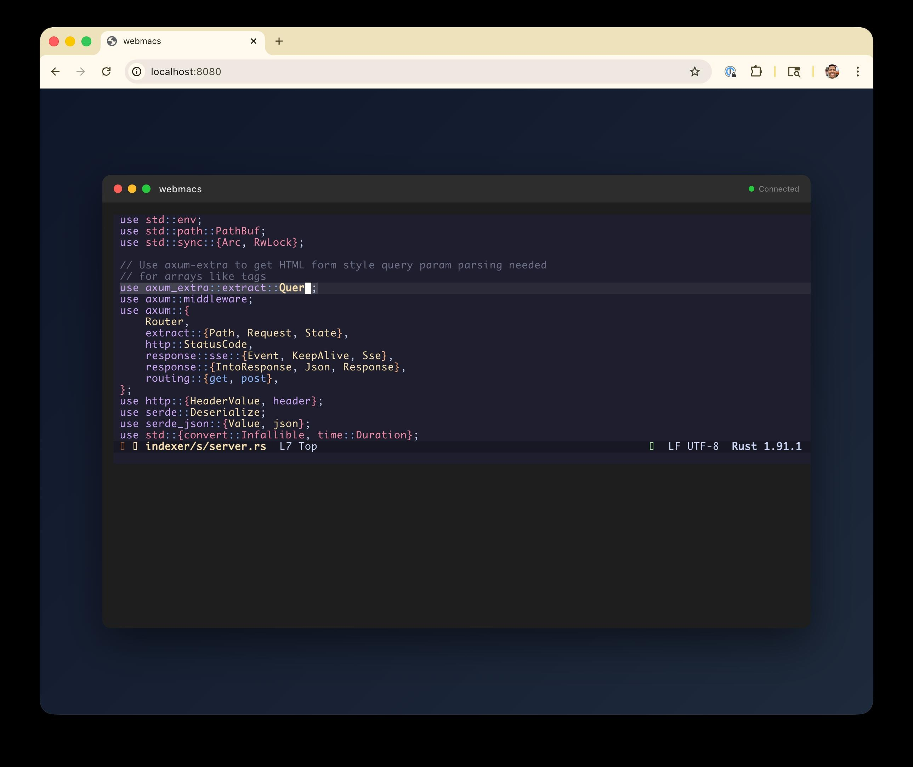

# webmacs

Terminal emulator for running Emacs in the browser via WebAssembly communicating to a server over websocket. Adapted from the [ghostty-web](https://github.com/coder/ghostty-web) demo.

## Quickstart

1. Run `cargo run`
2. Open http://localhost:8080 in your browser
3. Type `emacs -nw`
